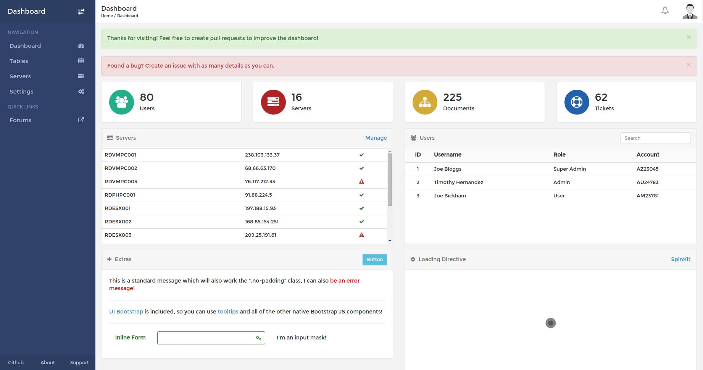

# AngularJS dashboard

Fully featured dashboard built with AngularJS. This project is ideal to start an AngularJS app using [grunt](http://gruntjs.com/) and [bower](http://bower.io/).
It's greatly inspired/copied from [rdash/rdash-angular](https://github.com/rdash/rdash-angular) but adapted with other tools and with more features.

With this template you will have :

- a login system already setted (see [AuthSrv](https://github.com/loicknuchel/angularjs-dashboard/blob/master/app/scripts/services.js))
- an advanced logging & tracking errors system with mixpanel integration example (see [log.js](https://github.com/loicknuchel/angularjs-dashboard/blob/master/app/scripts/log.js))
- many helpers such as [filters for dates](https://github.com/loicknuchel/angularjs-dashboard/blob/master/app/scripts/filters.js)
- [moment](http://momentjs.com/) (date manipulation lib) & [lodash](http://lodash.com/) (functionnal utility helpers) are included

Live example : TODO

## Getting started

- clone the repo `git clone git@github.com:loicknuchel/angularjs-dashboard.git`
- go to project folder `cd angularjs-dashboard`
- run `npm install`
- run `bower install`
- run `grunt serve`
- You're setup with a shiny livereload :D

## TODO

- create some directive to create charts with highcharts
- create some utils for Parse & Firebase

## Feedback

Any feedback will be greatly appreciated.

Feel free to open issues / pull requests for bugs, general discussions or feature request.
